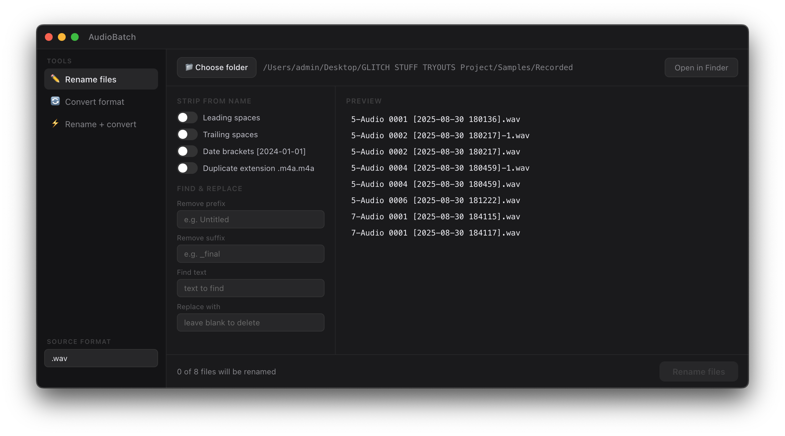
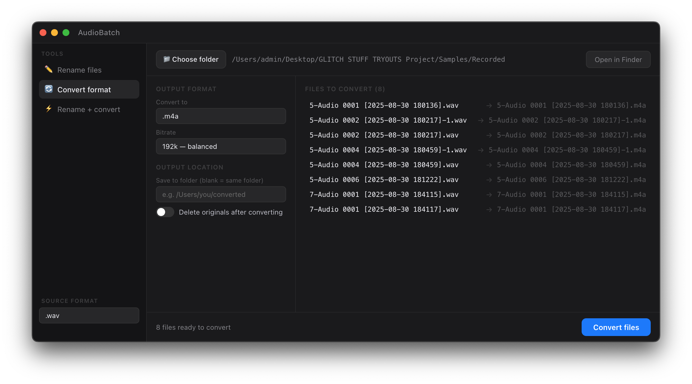
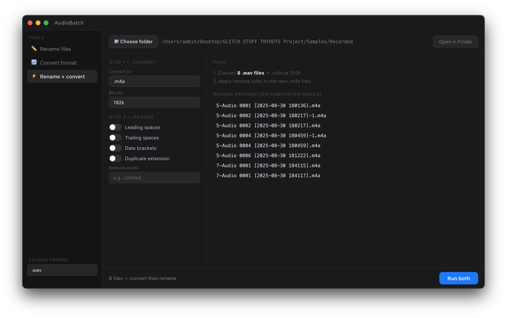

# AudioBatch

A macOS desktop app for batch renaming and converting audio files. Built with Electron + React.

### Rename files


### Convert format


### Rename + Convert


## Prerequisites

- Node.js 18+ (https://nodejs.org)
- npm
- ffmpeg (for format conversion): `brew install ffmpeg`

## Setup

```bash
# 1. Install dependencies
npm install

# 2. Run in development mode
npm start
```

This opens the app window automatically. The React dev server runs on port 3000 and Electron loads it.

## Build a standalone .app

```bash
# Build and package as a macOS .app
npm run dist
```

The `.app` file will be in the `dist/` folder. Drag it to your Applications folder.

## Features

- **Rename files** — strip leading/trailing spaces, date brackets, duplicate extensions, prefixes, suffixes, find & replace
- **Convert format** — mp3, m4a, wav, flac, aac, ogg, aiff with selectable bitrate
- **Rename + convert** — do both in one step

## Notes

- Rename changes are previewed before applying — nothing is modified until you click "Rename files"
- ffmpeg must be installed for format conversion (`brew install ffmpeg`)
- The app targets the source format you select in the sidebar (e.g. all .mp3 files in the chosen folder)
